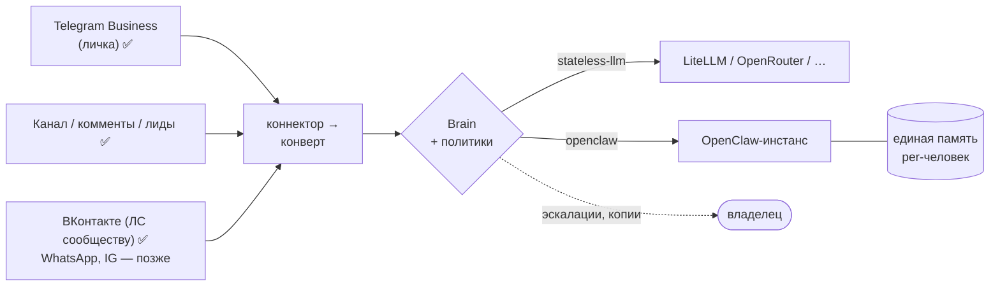

# telegram-secretary

> AI-секретарь для Telegram — отвечает за тебя в личке, а в перспективе ведёт канал,
> комментарии и другие платформы с единой памятью на базе OpenClaw.

[](./LICENSE)
[](https://nodejs.org)
[](https://github.com/Rivega42/telegram-secretary/actions/workflows/ci.yml)

Открытый шаблон на Node.js. Разворачивается за 10 минут (есть Docker). Работает через любой
OpenAI-совместимый API или OpenClaw-инстанс с единой памятью.

**Хочешь готовое решение без настройки?** → [grandhub.ru](https://grandhub.ru)

---

## Что это

Прокси между Telegram Business API и «мозгом» (LLM или OpenClaw-агент). Когда тебе пишут
в личку, а ты занят — ассистент отвечает сам, в твоём стиле, помня историю диалога
и твои собственные реплики.

- Ответ через 2 мин днём (08–18 МСК), 3 мин ночью; если ты ответил сам — автоответ отменяется
- **Управление из Telegram**: `/on` `/off` `/vacation` `/draft` `/status` + кнопки под
  уведомлениями («⚡ сейчас», «✍️ свой ответ», «🚫 отмена», политика контакта в один тап)
- **Draft-режим**: ответ уходит клиенту только после твоего «📤 Отправить»
  (есть «🔄 Переписать» со свободным комментарием)
- Контекст 25 сообщений с таймстемпами, включая реплики владельца
- **Персона в конфиге** (`persona/`): имя, стиль, красные линии — без правки кода
- **Политики контактов**: `auto` / `escalate` (семья, VIP — сразу тебе, без LLM) / `ignore` (спам)
- Голосовые/фото не отвечаются невпопад — эскалируются тебе; серия сообщений
  не спамит уведомлениями (одно, редактируется)
- **Два мозга**: любой OpenAI-совместимый endpoint (из коробки) или OpenClaw-инстанс
  с единой памятью о каждом человеке
- **Комментарии канала и групповой чат**: отвечает на вопросы под постами и по упоминанию;
  каждый публичный ответ — черновик тебе на подтверждение, rate-limit от троллей,
  публичная персона с раскрытием ИИ
- **Автопостинг канала**: по расписанию и контент-плану (или `/post тема`), публикация
  только после твоего «📤»; **лид-воронка**: кнопка под постом → личка бота → «🔥 Лид» тебе
- Реалистичность: «прочитано» и «печатает…» перед ответом; ротация логов с переписками
- **ВКонтакте**: личные сообщения сообществу (Callback API) с той же памятью;
  «Иван из ВК» и «Иван из Telegram» объединяются в одну персону по твоему подтверждению

## Архитектура

Целевая схема — «коннекторы поверхностей ↔ мозг с единой памятью»
([docs/openclaw-integration.md](./docs/openclaw-integration.md)). Этап 1 (ядро) реализован:



Подробные схемы (компоненты, sequence-поток, данные): [docs/architecture.md](./docs/architecture.md).
Управление в работе: [docs/operations.md](./docs/operations.md).

```
src/
  server.js                 # точка входа: валидация env, listen
  app.js                    # Express: webhook, политики, админ-API
  scheduler.js              # очередь отложенных ответов (переживает рестарт)
  core/
    envelope.js             # платформо-нейтральный конверт + capabilities
    brain.js                # интерфейс мозга, выбор драйвера
    persona.js              # персона из persona/ (шаблоны, disclosure per-surface)
    identity.js             # персоны: память по людям, политики, явное слияние
    instances.js            # реестр инстансов + маршрутизация поверхностей
  brains/
    stateless-llm.js        # OpenAI-совместимый endpoint, локальная история
    openclaw.js             # сессии OpenClaw per-человек, единая память
  connectors/telegram/
    business.js             # Telegram Business ↔ конверт
persona/                    # конфиг персоны: persona.json, base.md, dm.md, public.md
```

## Быстрый старт

### Docker (рекомендуется)

```bash
git clone https://github.com/Rivega42/telegram-secretary
cd telegram-secretary
cp .env.example .env   # заполни (см. ниже)
docker compose up -d
curl http://127.0.0.1:18792/health
```

С локальным OpenClaw-инстансом (единая память):

```bash
docker compose --profile gateway up -d
# в .env: GW_BASE_URL=http://openclaw-gateway:18789, BRAIN_DRIVER=openclaw
```

### Без Docker

```bash
npm install
npm start          # боевой запуск
npm test           # тесты (29, node:test)
# локально без токенов и LLM:
DRY_RUN=true DRY_RUN_BRAIN=true OWNER_CHAT_ID=1 npm start
```

Боевое развёртывание (PM2, Nginx, webhook): [docs/deployment.md](./docs/deployment.md)

## Конфигурация (.env)

```env
BUSINESS_BOT_TOKEN=    # токен бота с включённым Business Mode
ONEINT_BOT_TOKEN=      # токен бота для уведомлений владельцу
OWNER_CHAT_ID=         # твой Telegram ID (число)
WEBHOOK_SECRET=        # случайная строка для проверки webhook
API_KEY=               # ключ авторизации админ-API (/api/*)
PORT=18792
STATE_DIR=./state

BRAIN_DRIVER=stateless-llm   # или openclaw (единая память)

# Мозг — вариант 1: любой OpenAI-совместимый (приоритетный, если задан)
LITELLM_BASE_URL=http://localhost:4000
LITELLM_API_KEY=sk-...
VIKA_MODEL=openai/gpt-4o

# Мозг — вариант 2: OpenClaw Gateway
GW_BASE_URL=http://127.0.0.1:18789
GW_API_KEY=...
```

Полный список с комментариями: [.env.example](./.env.example).
Несколько инстансов и маршрутизация: [instances.example.json](./instances.example.json).

## Настройка персоны

Каталог `persona/` — это и есть «характер» секретаря, код его не содержит:

| Файл | Что настраивает |
|---|---|
| `persona.json` | Имя секретаря, данные владельца, fallback-ответы, **disclosure** |
| `base.md` | Характер и красные линии (поддерживает `{{owner_name}}` и др.) |
| `dm.md` | Стиль лички |
| `public.md` | Стиль публичных поверхностей (комменты, канал — этап 3) |

`disclosure` управляет раскрытием ИИ-природы per-поверхность. Для публичных поверхностей
по умолчанию включено; режим нераскрытия в личке — ответственность владельца (см. ниже).

## Политики контактов

```bash
# список персон (память по людям, а не платформенным ID)
curl -H "X-Api-Key: $API_KEY" http://127.0.0.1:18792/api/persons

# семья/VIP: без автоответа, сразу эскалация владельцу
curl -X POST -H "X-Api-Key: $API_KEY" -H 'Content-Type: application/json' \
  -d '{"policy":"escalate"}' http://127.0.0.1:18792/api/persons/person-0001/policy

# слияние персон между платформами — только явное, по решению владельца
curl -X POST -H "X-Api-Key: $API_KEY" -H 'Content-Type: application/json' \
  -d '{"source_id":"person-0002"}' http://127.0.0.1:18792/api/persons/person-0001/merge
```

## Документация

| Документ | Содержание |
|---|---|
| [docs/architecture.md](./docs/architecture.md) | Текущая архитектура: компоненты, поток сообщения, стейт (mermaid) |
| [docs/operations.md](./docs/operations.md) | Управление и эксплуатация: режимы, политики, мониторинг, бэкап |
| [docs/openclaw-integration.md](./docs/openclaw-integration.md) | Целевая архитектура: единая память, мультиплатформенность |
| [docs/deployment.md](./docs/deployment.md) | Развёртывание: Docker, PM2, Nginx, webhook |
| [docs/vika-style.md](./docs/vika-style.md) | Стиль общения секретаря |
| [docs/memory-update-rules.md](./docs/memory-update-rules.md) | Правила обновления памяти |
| [docs/contacts-template.md](./docs/contacts-template.md) | Шаблон карточки контакта |
| [USE-CASES.md](./USE-CASES.md) | Сценарии применения |
| [ROADMAP.md](./ROADMAP.md) | План развития по этапам |
| [CONTRIBUTING.md](./CONTRIBUTING.md) | Как участвовать в разработке |
| [CHANGELOG.md](./CHANGELOG.md) | История изменений |

## Безопасность

- `/api/*` защищён ключом `API_KEY` (заголовок `X-Api-Key`); без ключа сервер предупреждает при старте
- Webhook проверяет `WEBHOOK_SECRET`
- Валидация env при старте: без обязательных токенов сервер не стартует (кроме DRY_RUN)
- `.env` держи с `chmod 600`; `STATE_DIR` содержит переписки — бэкапь и не публикуй
- В Docker процесс работает под непривилегированным пользователем, стейт — в volume

⚠️ **Об ответственности:** режим нераскрытия ИИ-природы (`disclosure: false`) предназначен
для личного использования. В ряде юрисдикций (например, EU AI Act) и на публичных площадках
раскрытие обязательно — поэтому для публичных поверхностей оно включено по умолчанию.
Используя шаблон, ты сам отвечаешь за соответствие местным законам и правилам платформ.

## Участие

PR и issues приветствуются — см. [CONTRIBUTING.md](./CONTRIBUTING.md).
Язык проекта и документации — русский.

## Готовое решение

Этот репозиторий — шаблон. Если хочешь работающий сервис с биллингом, инфраструктурой
и поддержкой: **→ [grandhub.ru](https://grandhub.ru) — личный AI-ассистент для бизнеса**

---

[MIT License](./LICENSE) · Сделано с ❤️ в Санкт-Петербурге
