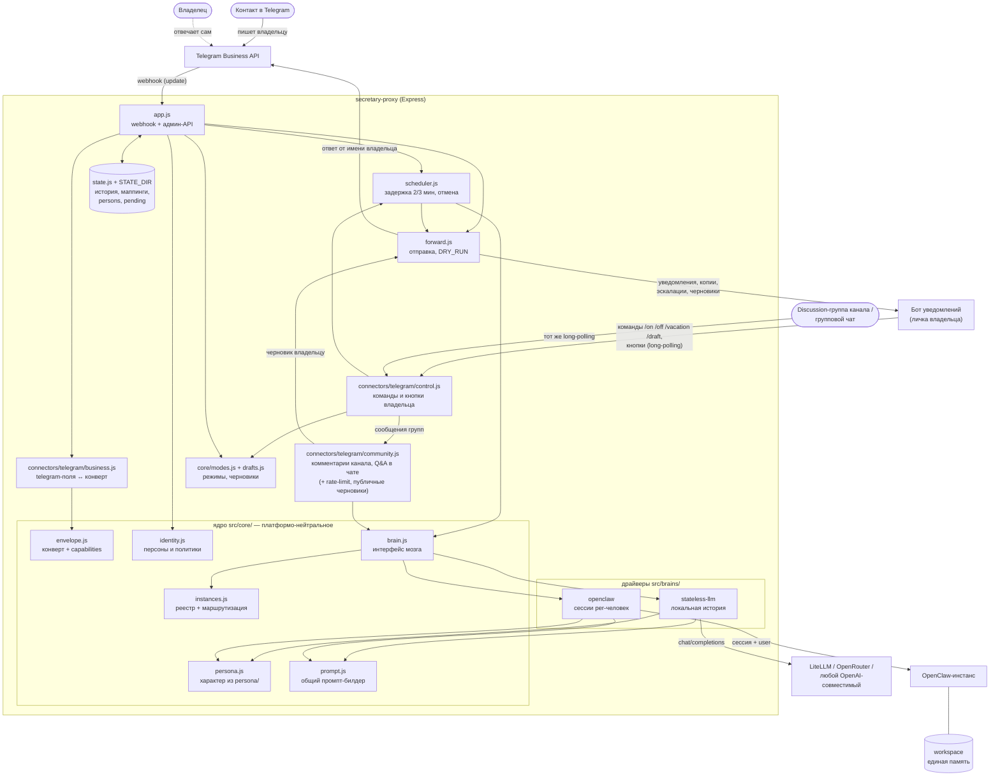
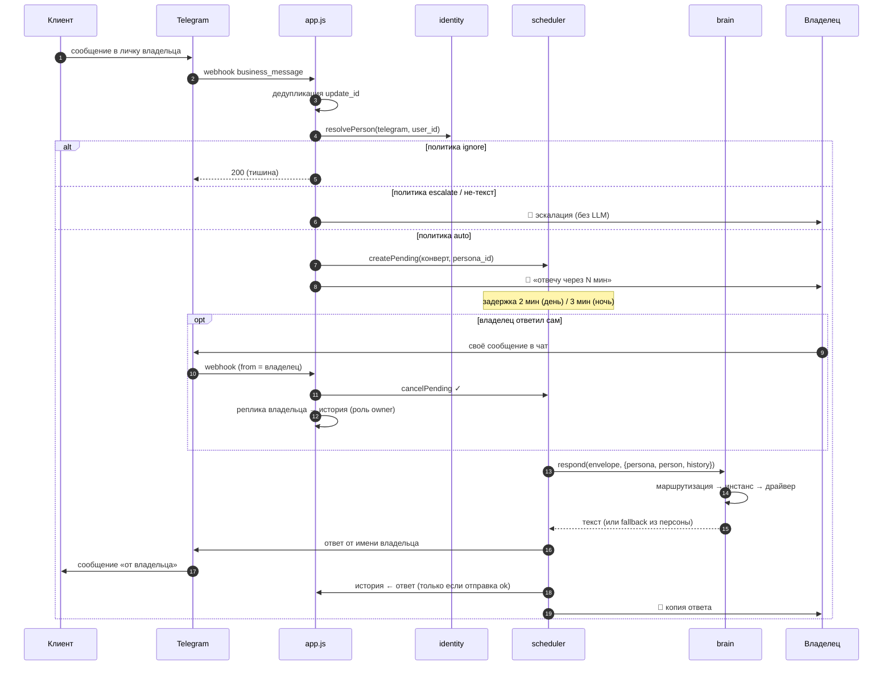
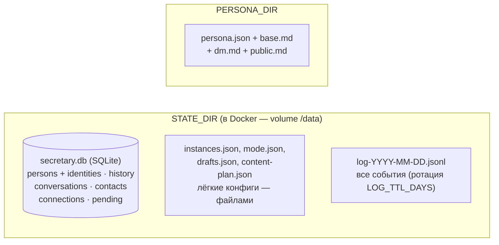

# Архитектура telegram-secretary

Секретарь-прокси между владельцем и его контактами в Telegram, построенный по схеме
«коннекторы поверхностей ↔ мозг» (целевая картина — `openclaw-integration.md`,
управление в работе — `operations.md`).

## Зачем

Когда владелец занят / спит / в отпуске — секретарь:
- принимает входящие от любых контактов через Telegram Business;
- отвечает в стиле владельца (персона настраивается в `persona/`);
- эскалирует важное: контакты с политикой `escalate` (семья, VIP) и не-текстовые
  сообщения уходят владельцу без автоответа;
- если владелец ответил сам — автоответ отменяется, а его реплика сохраняется
  в историю (секретарь не противоречит сказанному).

## Карта компонентов: кто с кем работает

Ключевое правило слоёв: **telegram-специфичные поля не выходят за пределы
`connectors/`** — ядро и драйверы видят только конверт (`envelope`).

## Поток входящего сообщения

## Данные: кто что хранит

Основной стейт — **SQLite** `secretary.db` (better-sqlite3, WAL, issue #26);
старые JSON-файлы импортируются автоматически при первом старте (`*.migrated`).

| Хранилище | Содержание | Кто пишет |
|---|---|---|
| `secretary.db` → `persons`, `person_identities` | Персоны: identities per-платформа, политики `auto/escalate/ignore` (O(1)-резолв) | `core/identity.js` |
| `secretary.db` → `history` | История диалогов per thread, **хронологически**, роли `client`/`vika`/`owner` | `state.js` |
| `secretary.db` → `pending` | Отложенные ответы (+конверт, +person_id); переживает рестарт | `scheduler.js` |
| `secretary.db` → `contacts`, `connections`, `conversations` | Telegram-метаданные и маппинги (индекс по чату) | `state.js` |
| `mode.json`, `drafts.json`, `content-plan.json` | Лёгкие конфиги — остаются файлами (удобно править руками) | `core/modes.js`, `core/drafts.js`, `channel.js` |
| `instances.json` | Реестр мозгов и маршрутизация; секреты через `${ENV}` | владелец (вручную) |
| `log-*.jsonl` | Полный журнал событий | `state.js` |

`contacts` и `persons` — намеренно разные сторы: contacts — сырые
telegram-метаданные (статистика), persons — платформо-независимая идентичность
и политики. Слияние персон между платформами — **только явное** (`/api/persons/:id/merge`).

## Эндпоинты

| Метод | Путь | Описание |
|---|---|---|
| `POST` | `/tg/business-webhook` | Telegram Business webhook (снаружи через Nginx: `/secretary/tg/business-webhook`) |
| `POST` | `/api/reply` | Ручной ответ клиенту по mapping_id |
| `GET` | `/api/contacts` | Контакты Telegram |
| `GET` | `/api/persons` | Персоны и политики |
| `POST` | `/api/persons/:id/policy` | Сменить политику (`auto`/`escalate`/`ignore`) |
| `POST` | `/api/persons/:id/merge` | Явное слияние персон (решение владельца) |
| `GET` | `/api/conversations` | Карта разговоров |
| `GET` | `/api/pending` | Очередь отложенных |
| `DELETE` | `/api/pending/:chatId` | Отменить отложенный ответ |
| `GET` | `/api/mode` | Текущий режим (auto/off/vacation) и draft-флаг |
| `GET` | `/health` | Health check |

Управление режимами и черновиками — командами/кнопками в Telegram
(см. `operations.md`), API даёт чтение состояния.

Все пути `/api/*` требуют заголовок `X-Api-Key` (env `API_KEY`).

## Известные ограничения (осознанные, MVP)

- Очередь pending ключуется telegram-`chat_id` (ВК отвечает без pending);
  при необходимости отложенных ответов на других платформах будет переведена
  на `envelope.thread_key`.
- Кэш `persona`/`instances` живёт до рестарта — правки конфигов требуют перезапуска.
- При падении процесса в момент генерации ответа задача уже снята с очереди —
  ответ не ретраится (владелец видит отсутствие копии).

## Дополнительно

- `operations.md` — управление: режимы, политики, мониторинг, бэкап
- `openclaw-integration.md` — целевая архитектура: единая память, мультиплатформенность
- `vika-style.md` — стиль общения секретаря
- `secretary-proxy-rules.md` — правила «секретарь-прокси»
- `memory-update-rules.md` — как обновлять файлы памяти
- `deployment.md` — как разворачивать (Docker / PM2 + Nginx)
