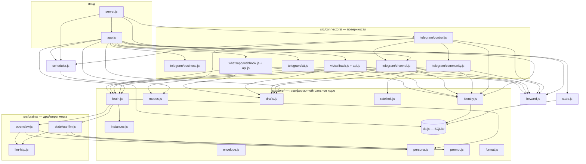
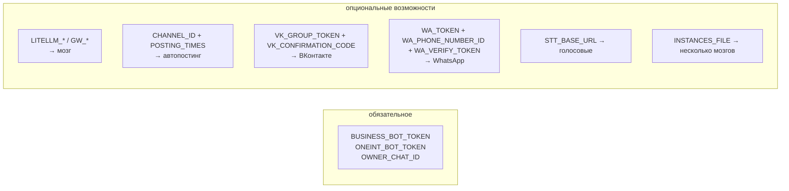

# Карта кода: где что лежит и какие функции

Справочник по модулям: ответственность, ключевые функции, зависимости,
и какая env-переменная что включает. Архитектурные схемы — `architecture.md`,
эксплуатация — `operations.md`.

## Зависимости модулей

Правило слоёв: платформенные поля живут только в `connectors/**`; ядро и
драйверы видят конверт (`envelope`). Коннекторы не знают друг о друге
(исключение: `control.js` маршрутизирует группы/лиды как транспорт).

## Вход и приложение

| Модуль | Ответственность | Ключевые функции |
|---|---|---|
| `src/server.js` | Точка входа: валидация env, listen, восстановление pending, запуск control-поллинга и автопостинга, ротация логов | `validateEnv()` |
| `src/app.js` | Express: webhook Telegram, роуты ВК/WA, админ-API, политики, draft-ветка, действия кнопок | `createApp()`, `executeBrainResponse(task)`, `sendManualReply(mappingId, text)`, `createControlActions()` |

## Ядро (`src/core/`)

| Модуль | Ответственность | Ключевые функции |
|---|---|---|
| `envelope.js` | Платформо-нейтральный конверт сообщения + `capabilities` | `createEnvelope({...})`, `routingKey(envelope)`, `SURFACES` |
| `brain.js` | Единая точка генерации ответа; выбор инстанса и драйвера; fallback из персоны при ошибках | `respond(envelope, ctx)` |
| `persona.js` | Персона per-tenant: БД (`tenant_persona`) → файлы `persona/` (default) → generic; disclosure per-surface | `loadPersona()`, `buildSystemPrompt()`, `setTenantPersona()`, `getTenantPersonaRaw()` |
| `identity.js` | Персоны: память по людям, политики, склейка только явная | `resolvePerson()`, `getPerson()`, `setPersonPolicy()`, `findSimilarPersons()`, `mergePersons()`, `POLICIES` |
| `instances.js` | Реестр LLM/OpenClaw-инстансов (`instances.json`, `${ENV}`-подстановка), маршрутизация `platform:surface → инстанс` | `loadInstances()`, `getInstanceFor(key)` |
| `prompt.js` | Общий промпт: контекст + история (хронологически!) + rewrite-блок | `buildUserPrompt(envelope, {history, persona, rewrite})` |
| `modes.js` | Режимы per-tenant `/on /off /vacation` + draft (`tenant_settings`) | `getSettings()`, `setMode()`, `setDraft()` |
| `drafts.js` | Черновики всех видов (`drafts.json`): dm / community / channel / vk / wa | `saveDraft()`, `getDraft()`, `deleteDraft()` |
| `ratelimit.js` | Скользящее окно для публичных ответов (на человека и чат) | `allowReply(chatId, userId)` |
| `stats.js` | Агрегаты для дайджеста/метрик из `history`/`persons` | `computeStats({sinceMs})`, `platformOf()` |
| `feedback.js` | Петля качества: правки (few-shot) и оценки 👍/👎 | `recordCorrection()`, `recordRating()`, `recentCorrections()`, `feedbackStats()` |
| `leads.js` | Лиды со статусами + выгрузка в CRM | `recordLead()`, `setLeadStatus()`, `listLeads()`, `leadsStats()`, `exportLeadToCrm()` |
| `tenant.js` | Реестр арендаторов (SaaS): резолв канала/секрета → арендатор, секреты | `createTenant()`, `resolveTenant()`, `registerChannel()`, `seedDefaultTenant()`, `setTenantSecret()`, `resolveTenantByWebhookSecret()` |
| `context.js` | Контекст арендатора (AsyncLocalStorage) — слой данных фильтрует по нему | `runWithTenant(id, fn)`, `currentTenantId()` |
| `billing.js` | Учёт расхода и лимиты по тарифам (`usage`, PLANS); гейт квоты | `checkQuota(platform)`, `recordUsage()`, `getUsage()`, `usageSummary()`, `PLANS` |
| `onboarding.js` | Self-serve онбординг (SaaS S5): создать арендатора, подключить бота, мастер готовности | `onboard()`, `connectTelegram()`, `checkReadiness()` |
| `secrets-crypto.js` | Шифрование секретов арендаторов at-rest (AES-256-GCM + слепой индекс HMAC) | `encryptSecret()`, `decryptSecret()`, `blindIndex()`, `isEncryptionEnabled()` |
| `db.js` | SQLite `secretary.db` (WAL): схема (вкл. `processed`/`feedback`/`leads`), авто-миграция старых JSON | `getDb()`, `closeDb()` |
| `format.js` | Мелкие форматтеры + timing-safe сравнение секретов | `truncate()`, `usernameDisplay()`, `timingSafeEqualStr()` |

## Драйверы мозга (`src/brains/`)

| Модуль | Когда используется | Ключевое |
|---|---|---|
| `stateless-llm.js` | Режим «из коробки»: любой OpenAI-совместимый endpoint, память — локальная история в промпте | `respond(envelope, ctx, instance)` |
| `openclaw.js` | OpenClaw-инстанс: сессия per-человек (`user` + session-заголовок), память в workspace; `stateful` — историю не дублирует | `respond(...)`; настройки инстанса: `stateful`, `send_system`, `session_header` |
| `llm-http.js` | Общий клиент `/v1/chat/completions` с таймаутом | `chatCompletions(instance, {messages,...})` |

## Коннекторы (`src/connectors/`)

| Модуль | Поверхность | Ключевые функции |
|---|---|---|
| `telegram/business.js` | Личка Telegram Business (от имени владельца) | `toEnvelope(msg)`, `reply(envelope, text)`, `detectAttachments()` |
| `telegram/setup.js` | Подключение бота арендатора (SaaS S5): валидация токена + регистрация вебхука | `getMe(token)`, `setWebhook(token, url, secret)`, `deleteWebhook(token)` |
| `telegram/control.js` | Пульт владельца: команды, кнопки, маршрутизация групп/лидов | `startControlLoop(actions)`, `handleControlUpdate()`, `handleCommand()`, `handleCallback()` |
| `telegram/community.js` | Комментарии канала, Q&A в группах, лид-воронка | `handleGroupMessage(msg, botInfo)`, `handleLeadMessage(msg)`, `classifySurface()`, `shouldReply()` |
| `telegram/channel.js` | Автопостинг по контент-плану (только черновик) | `startPostingSchedule()`, `generatePost(topic)`, `nextTopic()`, `recordPosted()` |
| `telegram/digest.js` | Дайджест владельцу: ежедневно + `/digest` | `startDigestSchedule()`, `buildDigestText()`, `sendDigest()` |
| `telegram/stt.js` | Whisper-транскрипция голосовых (опционально) | `transcribeVoice(msg)`, `isSttConfigured()` |
| `vk/api.js`, `vk/callback.js` | ЛС сообществу ВКонтакте (Callback API) | `vkCallbackHandler(req,res)`, `handleVkMessage()`, `sendVkMessage()` |
| `whatsapp/api.js`, `whatsapp/webhook.js` | Личка WhatsApp бизнес-номера (Cloud API) | `waVerifyHandler()`, `waWebhookHandler()`, `handleWaMessage()`, `sendWaMessage()` |

## Прочее

| Модуль | Ответственность | Ключевые функции |
|---|---|---|
| `src/state.js` | Стейт поверх SQLite: контакты, маппинги, история; логи JSONL + ротация | `getOrCreateMapping()`, `findMappingByChat()`, `getConversationHistory()` (хронологически!), `appendConversationHistory()`, `markProcessed()/unmarkProcessed()`, `rotateLogs()` |
| `src/forward.js` | Вся отправка в Telegram (уважает `DRY_RUN`): ответы, уведомления с кнопками, редактирование, typing | `sendBusinessReply()`, `notifyOwnerText(text, {buttons})`, `editOwnerMessage()`, `answerCallback()`, `sendGroupReply()`, `simulateTyping()`, `getControlUpdates()` |
| `src/scheduler.js` | Очередь отложенных ответов (persistence в SQLite, переживает рестарт) | `createPending()`, `cancelPending()`, `executePendingNow()`, `loadPendingFromFile()`, `getDelayMinutes()` |

## Настройка: какая переменная что включает

| Возможность | Переменные | Где код |
|---|---|---|
| Личка Telegram (база) | `BUSINESS_BOT_TOKEN`, `ONEINT_BOT_TOKEN`, `OWNER_CHAT_ID`, `WEBHOOK_SECRET` | `app.js`, `connectors/telegram/business.js` |
| Мозг | `LITELLM_BASE_URL`+`LITELLM_API_KEY`+`VIKA_MODEL` или `GW_BASE_URL`+`GW_API_KEY`; `BRAIN_DRIVER` | `core/brain.js`, `core/instances.js` |
| Несколько мозгов / маршрутизация | `INSTANCES_FILE` (см. `instances.example.json`) | `core/instances.js` |
| Управление из Telegram | включено по умолчанию; `CONTROL_POLLING=false` — выкл | `connectors/telegram/control.js` |
| Публичные поверхности TG | бот в группе + privacy off; `PUBLIC_AUTO_REPLY`, `RATELIMIT_*` | `connectors/telegram/community.js` |
| Автопостинг | `CHANNEL_ID`, `POSTING_TIMES`; темы — `content-plan.json` | `connectors/telegram/channel.js` |
| ВКонтакте | `VK_GROUP_TOKEN`, `VK_CONFIRMATION_CODE`, `VK_SECRET` | `connectors/vk/` |
| WhatsApp | `WA_TOKEN`, `WA_PHONE_NUMBER_ID`, `WA_VERIFY_TOKEN`, `WA_APP_SECRET` | `connectors/whatsapp/` |
| Голосовые | `STT_BASE_URL`, `STT_API_KEY`, `STT_MODEL` | `connectors/telegram/stt.js` |
| Админ-API | `API_KEY` (заголовок `X-Api-Key`) | `app.js` |
| Отладка | `DRY_RUN`, `DRY_RUN_BRAIN` | `forward.js`, `core/brain.js` |
| Тонкая настройка | `HISTORY_CONTEXT_LIMIT`, `LLM_TIMEOUT_MS`, `VACATION_DELAY_SECONDS`, `LOG_TTL_DAYS`, `TYPING_SIMULATION` | соответствующие модули |

Полный список с комментариями: [.env.example](../.env.example).

## Как добавить новую платформу (чеклист)

1. `src/connectors/<платформа>/api.js` — клиент API c `DRY_RUN`-гейтом
2. `.../webhook.js` — приём событий → `createEnvelope({platform, surface, identity, threadKey, text, raw})`
3. Поток: `resolvePerson` → политика (`ignore`/`escalate`) → `brainRespond` →
   draft-режим (`getSettings().draft` → `saveDraft` c новым `kind`) → отправка → история
4. `app.js`: роут + ветка нового `kind` в `approveDraft`
5. `suggestMerge` через `findSimilarPersons` — единая память
6. Тесты по образцу `tests/vk.test.js` / `tests/whatsapp.test.js`
7. Доки: `operations.md` (настройка), `.env.example`, CHANGELOG, ROADMAP

Ядро (`core/`, `brains/`) трогать не нужно — это проверено ВК и WhatsApp.
