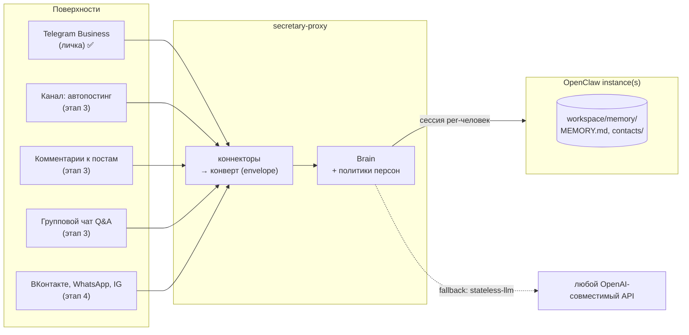
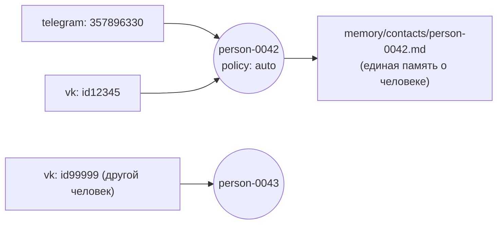

# Интеграция с OpenClaw: целевая архитектура

> Дизайн-документ. Описывает, как telegram-secretary эволюционирует из standalone-прокси
> в систему «коннекторы поверхностей ↔ мозг с единой памятью» на базе инстансов OpenClaw.
>
> **Статус реализации:** этап 1 (ядро) реализован — Brain-интерфейс, конверт, персона
> в конфиге, identity-слой, реестр инстансов, драйверы `stateless-llm` и `openclaw`.
> Формат реестра — `instances.json` (см. `instances.example.json`), а не yaml,
> чтобы не добавлять зависимость. Текущее состояние кода — `docs/architecture.md`.

## Проблема

Сейчас secretary-proxy использует LLM как stateless-endpoint: промпт собирается из локальных
JSONL-файлов, память изолирована внутри прокси. Если так же подключить канал, комментарии и
другие платформы — получится несколько разрозненных хранилищ контекста. Единой памяти не будет.

## Решение: инверсия ролей

**OpenClaw-инстанс — мозг и память. telegram-secretary — тонкий коннектор поверхностей.**

У OpenClaw уже есть всё, чего не хватает прокси: workspace с памятью (`MEMORY.md` + `memory/*.md`),
правила её обновления, инструменты, мульти-агентность. У OpenClaw нет Telegram Business API
(личка от имени владельца) и логики «канал / комментарии / обсуждения». Это ниша данного репозитория.



## Ключевые компоненты

### 1. Интерфейс Brain

Ядро не знает слов «telegram» или «business_connection_id». Один метод:

```js
Brain.respond(envelope) → { text, escalate?, confidence? }
```

Два драйвера:

| Драйвер | Что делает | Когда использовать |
|---|---|---|
| `stateless-llm` | Текущее поведение: OpenAI-совместимый endpoint + локальная история | Режим «из коробки», без OpenClaw |
| `openclaw` | Сессии агента: одна сессия на контакт (`session key = person id`). Агент сам ведёт контекст и обновляет память в workspace | Основной режим с единой памятью |

В режиме `openclaw` «единая память» — не отдельная фича, которую нужно синхронизировать,
а следствие того, что все поверхности ходят в один workspace.

### 2. Платформо-нейтральный конверт сообщения

```js
{
  platform: 'telegram' | 'vk' | 'whatsapp' | 'instagram',
  surface:  'dm' | 'comments' | 'channel_post' | 'group',
  identity: { platform_user_id, username, display_name },
  thread_key: 'tg:dm:357896330',
  text, attachments: [],
  capabilities: { typing: true, read_receipt: true, buttons: true, edit: false }
}
```

`capabilities` обязателен: в Telegram есть «печатает…» и inline-кнопки, в Instagram-комментариях —
ничего. Ядро запрашивает фичу через флаг, а не предполагает её наличие.

### 3. Identity: память по персонам, не по платформенным ID

Главная сложность мультиплатформенности: Иван в личке TG и `ivan_petrov` во ВК — для системы
два разных человека. Память ведётся **по персонам**:



```
memory/contacts/person-0042.md
  identities:
    telegram: 357896330
    vk: id12345
  # далее по шаблону docs/contacts-template.md
```

Правила склейки:
- Автоматическое слияние **запрещено** (ложная склейка = утечка контекста одного человека другому)
- Агент замечает совпадение (имя, телефон, «я вам писал в телеге») → предлагает владельцу
  склейку кнопкой «Это один человек?» → слияние только по подтверждению
- Схема закладывается с первого дня, даже пока платформа одна — менять ключи памяти задним числом мучительно

### 4. Реестр инстансов и маршрутизация

Конфиг `instances.yaml` в `STATE_DIR`:

```yaml
instances:
  main:
    base_url: http://127.0.0.1:18789
    token: ${OPENCLAW_TOKEN}
    agent: vika
  cheap:
    base_url: http://127.0.0.1:18790
    token: ${OPENCLAW_TOKEN_2}
    agent: poster

routing:
  business_dm:   main     # личка — на умной модели
  comments:      main
  channel_posts: cheap    # автопостинг — на дешёвой
```

**Инвариант:** один владелец = один workspace памяти. Инстансов может быть много (разные модели,
разные роли), но если память должна быть единой — они работают с общим workspace
(shared volume или синхронизация workspace средствами OpenClaw). Иначе — расщеплённая личность.

### 5. Персона: платформа × поверхность

Стиль из текущего `vika.js` писался для лички 1-на-1. В публичных комментариях те же правила
неприменимы (флирт под постом компании — репутационный риск; нераскрытие ИИ публично — отдельная
юридическая история, см. ниже). Персона выносится из кода в конфиг с матрицей:

```yaml
persona:
  name: Вика
  owner: { name: Роман, username: rivega42 }
  base: persona/base.md          # общий характер
  surfaces:
    dm:       persona/dm.md       # тёплый личный стиль
    comments: persona/public.md   # публичный: нейтрально, без флирта
    channel:  persona/public.md
  disclosure: configurable        # раскрытие ИИ-природы — опция, не зашитое поведение
```

## Поверхности (этап 3)

| Поверхность | Механика | Особенности |
|---|---|---|
| Комментарии канала | Бот-админ в linked discussion group, ловит reply на пересланный пост | Реактивно, проще всего |
| Q&A в чате | Триггеры: упоминание, reply на сообщение бота | Обязателен rate-limit на человека и чат |
| Автопостинг | Cron + контент-план (агент ведёт его в memory) | Draft-режим по умолчанию: черновик владельцу с кнопками «Опубликовать / Переписать / Пропустить» |

Правила памяти для публичных поверхностей (расширение `memory-update-rules.md`):
личка — пишем подробно; комментарии — только факты о повторяющихся людях;
разовый прохожий в чате — не пишем вообще.

## Платформы (этап 4)

| Платформа | Сложность | Механика | Подводные камни |
|---|---|---|---|
| ВКонтакте | Низкая | Callback API сообщества: ЛС, стена, комментарии | Только от имени сообщества — автоматизация личной страницы запрещена правилами ВК |
| WhatsApp | Средняя | Business Cloud API | Платные диалоги; первым писать можно только шаблонами (окно 24 ч) |
| Instagram | Высокая | Meta Graph API (Business/Creator) | App review, ограниченные разрешения, личные DM обычного аккаунта недоступны в принципе |

## Правовая заметка о нераскрытии ИИ

Режим «не раскрывает ИИ-природу» — осознанный выбор владельца для личного использования.
Для публичных поверхностей и ряда юрисдикций (EU AI Act, ст. 50; правила Meta для ботов)
раскрытие обязательно. Поэтому раскрытие/нераскрытие — **настраиваемая опция персоны**,
а не зашитое поведение, и для публичных поверхностей по умолчанию включено раскрытие.

## Целевая структура репозитория

```
src/
  core/                # Brain-интерфейс, persona, identity, routing, конверт
  brains/
    stateless-llm.js   # текущий режим (fallback без OpenClaw)
    openclaw.js        # сессии агента, единая память
  connectors/
    telegram/          # business-dm, channel, comments, group
    vk/                # этап 4
```

## Этапы (соответствуют epic-issues)

1. **Ядро** — Brain-интерфейс, конверт сообщения, персона в конфиг, identity-слой, реестр инстансов
2. **Control plane** — управление из Telegram: кнопки на pending, draft-режим, выключатель, политики контактов
3. **Канал** — комментарии → Q&A в чате → автопостинг
4. **Мультиплатформенность** — ВК → WhatsApp → Instagram
5. **Надёжность** — тесты, ротация логов, SQLite, обработка не-текста, Dockerfile

Драйвер `stateless-llm` сохраняется навсегда как режим шаблона «из коробки»: без памяти,
но рабочий за 10 минут без OpenClaw-инстанса.
