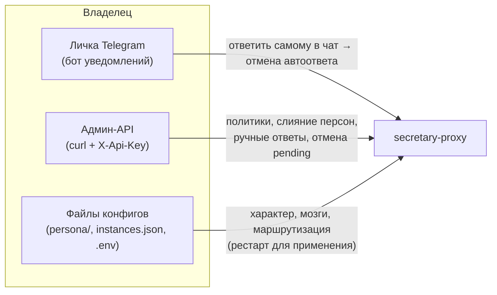
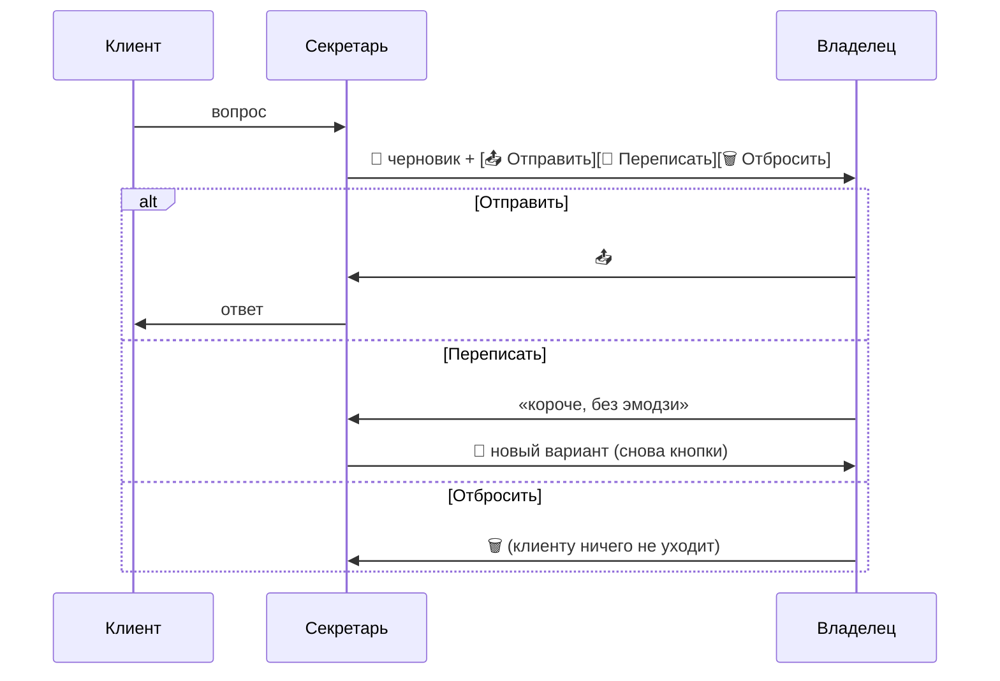
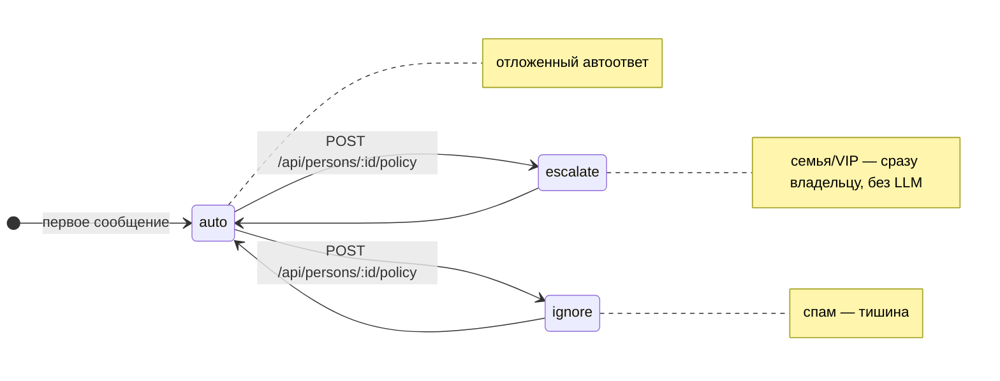
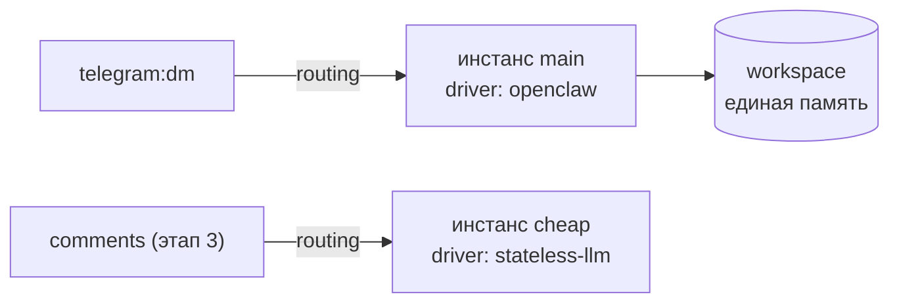

# Управление и эксплуатация

Руководство оператора: как управлять секретарём в работе — режимы, политики,
персона, инстансы, мониторинг, бэкап.

## Кто чем управляет



| Канал управления | Что делает | Когда применяется |
|---|---|---|
| **Команды и кнопки в Telegram** | Режимы, черновики, политики, «свой ответ», отмена — основной канал | Мгновенно |
| **Ответ владельца в чат** | Отменяет отложенный автоответ; реплика попадает в контекст секретаря | Мгновенно |
| **Админ-API** (`/api/*`) | То же, что кнопки, но скриптами (политики, слияние, ручной ответ) | Мгновенно |
| **`persona/`** | Имя, стиль, красные линии, раскрытие ИИ | После рестарта |
| **`instances.json`** | Какие мозги и для каких поверхностей | После рестарта |
| **`.env`** | Токены, задержки, режимы DRY_RUN, драйвер по умолчанию | После рестарта |

## Управление из Telegram (бот уведомлений)

Бот уведомлений — это пульт секретаря. Команды:

| Команда | Действие |
|---|---|
| `/on` | 🟢 Обычный режим: автоответ с задержкой 2/3 мин |
| `/off` | ⏸ «Я свободен»: только уведомления, автоответов нет |
| `/vacation` | 🏖 Отпуск: отвечать почти сразу (~20 сек, `VACATION_DELAY_SECONDS`) |
| `/draft` | 📝 Вкл/выкл черновики: ответ уходит только после твоего подтверждения |
| `/status` | Текущий режим, черновики, очередь |
| `/help` | Справка |

Кнопки под уведомлением о входящем:

```
📨 [Pending → a1b2c3] @ivan (Иван): «Сколько стоит?»
⏱ Отвечу через 2 мин если ты не ответишь сам
[⚡ Ответить сейчас] [✍️ Свой ответ] [🚫 Отменить]
[🔴 Только мне]      [🔇 Игнорить]
```

- **⚡ Ответить сейчас** — не ждать таймер
- **✍️ Свой ответ** — следующее твоё сообщение боту уйдёт клиенту от имени секретаря
- **🔴 Только мне / 🔇 Игнорить** — политика контакта в один тап
- Серия сообщений от одного человека не спамит: уведомление **редактируется**, таймер перезапускается

### Draft-режим (черновики)



Без подтверждения **ничего не уходит клиенту** — авто-таймаута у черновика нет.
Это рекомендуемый режим для первых дней работы и обязательный для будущих
публичных поверхностей (этап 3).

Поллинг управления можно выключить: `CONTROL_POLLING=false` (тогда только API).

## Публичные поверхности: комментарии канала и групповой чат

Тот же бот уведомлений работает community-ботом:

1. Добавь бота в **discussion-группу канала** (или обычную группу)
2. В BotFather: `/setprivacy` → **Disable** (иначе бот не видит сообщения группы)
3. Готово — настройки по умолчанию безопасны

Когда секретарь реагирует (иначе молчит):

| Триггер | Комментарии к посту | Групповой чат |
|---|---|---|
| Упоминание `@бота` | ✅ | ✅ |
| Reply на сообщение бота | ✅ | ✅ |
| Вопрос («?») | ✅ | — |

Защита публичных ответов:

- **Каждый ответ — черновик владельцу** («📤 Опубликовать / 🔄 Переписать / 🗑»).
  Автопубликация: `PUBLIC_AUTO_REPLY=true` (не рекомендуется)
- **Rate-limit**: 3 ответа на человека и 10 на чат за 10 минут
  (`RATELIMIT_PER_USER`, `RATELIMIT_PER_CHAT`, `RATELIMIT_WINDOW_MS`)
- **Публичная персона** (`persona/public.md`) — без флирта, с раскрытием ИИ
  (disclosure для `comments`/`group` включён в persona.json)
- Политики персон действуют и здесь (ignore в группе = молчание);
  комментатор резолвится в ту же персону, что и в личке
- История группы **не пишется** в память — разовые прохожие не засоряют контекст

## ВКонтакте (личные сообщения сообществу)

1. В сообществе: Управление → Работа с API → создай **токен** с правом «сообщения»
2. Callback API: адрес `https://<домен>/vk/callback`, скопируй **строку подтверждения**
   и задай **секретный ключ**; включи событие «Входящее сообщение»
3. `.env`: `VK_GROUP_TOKEN`, `VK_CONFIRMATION_CODE`, `VK_SECRET` → рестарт

Отличия от Telegram-лички: сообщество — явный «офис», поэтому ответ уходит сразу
(без отложенного таймера). Глобальный `/draft` и политики персон действуют.
Если новый vk-собеседник похож на знакомого из Telegram (username/имя) — придёт
предложение склейки «✅ Это один человек / ❌ Разные» (память объединяется только
по подтверждению).

## Автопостинг канала

1. Сделай бота уведомлений **админом канала**, укажи `CHANNEL_ID=@my_channel`
2. Задай расписание: `POSTING_TIMES=10:00,18:00` (МСК)
3. Темы — в `STATE_DIR/content-plan.json`: `{ "topics": ["тема 1", "тема 2"] }`
   (ротируются по кругу; журнал опубликованного ведётся автоматически)

Пост **никогда не публикуется сам**: в назначенное время владельцу приходит черновик
«📤 Опубликовать / 🔄 Переписать / 🗑 Отбросить». Вне расписания: `/post` (следующая
тема из плана) или `/post своя тема`.

## Лид-воронка

Под постом канала можно дать кнопку-ссылку `https://t.me/<бот>?start=post_42`.
Человек, написавший боту в личку:

- получает ответ публичной персоны сразу (это явный бот — раскрытие очевидно)
- источник (`post_42`) фиксируется в истории лида (истории лида (SQLite))
- владельцу приходит «🔥 Лид» с источником, репликами и кнопкой «Игнорить»
- rate-limit и политики персон действуют

## Режимы запуска

| Режим | Переменные | Поведение |
|---|---|---|
| Боевой | заполненный `.env` | Реальные ответы клиентам |
| Без отправки | `DRY_RUN=true` | LLM вызывается, в Telegram ничего не уходит (лог) |
| Без LLM | `DRY_RUN_BRAIN=true` | Заглушка вместо LLM, отправка реальная |
| Полная отладка | оба `=true` | Ничего наружу; для локальной разработки и CI |

## Политики контактов

Каждому пишущему человеку создаётся **персона** (таблица в `secretary.db`) с политикой:



Быстрый способ — кнопки «🔴 Только мне» / «🔇 Игнорить» под уведомлением.
То же самое через API:

```bash
# посмотреть всех
curl -s -H "X-Api-Key: $API_KEY" localhost:18792/api/persons | jq

# мама не должна получать автоответы:
curl -X POST -H "X-Api-Key: $API_KEY" -H 'Content-Type: application/json' \
  -d '{"policy":"escalate"}' localhost:18792/api/persons/person-0003/policy

# слияние «Иван из TG» + «Иван из VK» — только по твоему решению:
curl -X POST -H "X-Api-Key: $API_KEY" -H 'Content-Type: application/json' \
  -d '{"source_id":"person-0007"}' localhost:18792/api/persons/person-0003/merge
```

## Очередь отложенных ответов

```bash
curl -s -H "X-Api-Key: $API_KEY" localhost:18792/api/pending | jq   # что в очереди
curl -X DELETE -H "X-Api-Key: $API_KEY" localhost:18792/api/pending/123456   # отменить
```

Самый быстрый способ отменить автоответ — **просто ответить человеку самому**:
прокси увидит твоё сообщение и снимет задачу.

Ручной ответ от имени секретаря (попадает в историю диалога):

```bash
curl -X POST -H "X-Api-Key: $API_KEY" -H 'Content-Type: application/json' \
  -d '{"mapping_id":"a1b2c3","text":"Добрый день! Передам."}' localhost:18792/api/reply
```

## Настройка персоны

`persona/persona.json` — имя секретаря, владелец, fallback-ответы и `disclosure`
(раскрывать ли ИИ-природу) по поверхностям. `base.md` / `dm.md` / `public.md` —
характер и стиль, поддерживают подстановки `{{secretary_name}}`, `{{owner_name}}`,
`{{owner_username}}`, `{{owner_info}}`.

Проверка после правок — без токенов:

```bash
DRY_RUN=true DRY_RUN_BRAIN=true OWNER_CHAT_ID=1 npm start
```

## Мозги и маршрутизация

Без конфига работает один инстанс из `.env`. Для нескольких — `STATE_DIR/instances.json`
(пример: `instances.example.json`): личка на умной модели, будущий автопостинг на дешёвой.
Секреты в файле — только ссылками `${ENV_VAR}`.



**Инвариант:** один владелец = один workspace памяти. Инстансов много — workspace общий.

## Мониторинг

```bash
curl -s localhost:18792/health | jq        # статус, аптайм, драйвер, очередь
docker compose logs -f secretary           # логи (или pm2 logs secretary-proxy)
```

- Каждый автоответ дублируется владельцу в личку (включая «⚠️ ОТПРАВКА НЕ УДАЛАСЬ»)
- События пишутся в `STATE_DIR/log-YYYY-MM-DD.jsonl` (содержат тексты переписок —
  ротация в роадмапе, этап 5)
- Docker-образ имеет встроенный HEALTHCHECK (виден в `docker ps`)

## Бэкап и восстановление

Весь стейт — каталог `STATE_DIR` (в Docker — volume `secretary-state`).
Основные данные — один файл `secretary.db` (SQLite), плюс логи и лёгкие конфиги:

```bash
# Docker
docker run --rm -v secretary-state:/data -v "$PWD":/backup alpine \
  tar czf /backup/secretary-state-$(date +%Y%m%d).tar.gz /data

# без Docker
tar czf backup-$(date +%Y%m%d).tar.gz "$STATE_DIR"
```

Восстановление: распаковать в `STATE_DIR` и перезапустить. Pending-задачи
восстановятся сами (`pending.json`), просроченные выполнятся сразу.

## Частые проблемы

| Симптом | Причина | Решение |
|---|---|---|
| Сервер не стартует, «Не заполнены переменные» | пустой `.env` | заполнить по `.env.example` |
| 401 на `/api/*` | нет/неверный `X-Api-Key` | передать ключ из `API_KEY` |
| Webhook 403 | secret_token ≠ `WEBHOOK_SECRET` | перерегистрировать webhook |
| Ответы-заглушки клиентам | LLM недоступен → fallback из персоны | проверить `GW_API_KEY`/`LITELLM_*`, логи `[Brain:*]` |
| Секретарь «не помнит» клиента между платформами | персоны не слиты | `POST /api/persons/:id/merge` |
