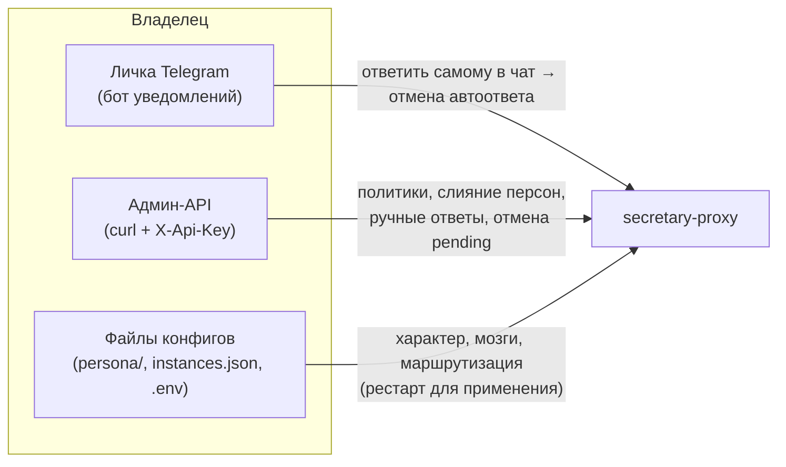
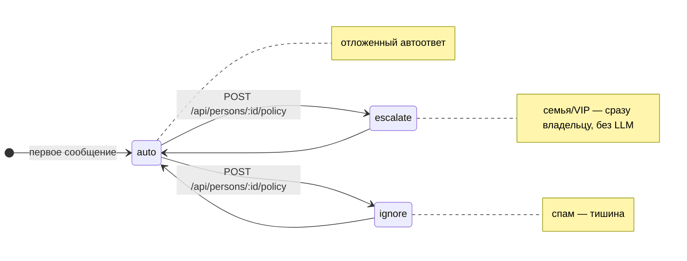
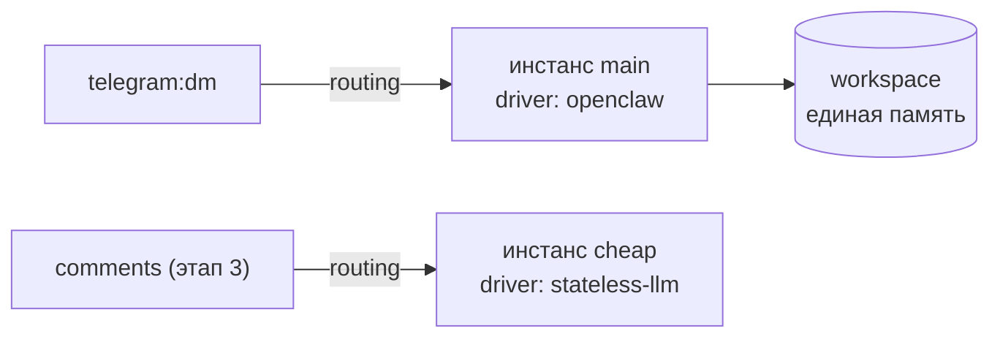

# Управление и эксплуатация

Руководство оператора: как управлять секретарём в работе — режимы, политики,
персона, инстансы, мониторинг, бэкап.

## Кто чем управляет



| Канал управления | Что делает | Когда применяется |
|---|---|---|
| **Ответ владельца в чат** | Отменяет отложенный автоответ; реплика попадает в контекст секретаря | Мгновенно |
| **Админ-API** (`/api/*`) | Политики контактов, слияние персон, ручной ответ, отмена pending | Мгновенно |
| **`persona/`** | Имя, стиль, красные линии, раскрытие ИИ | После рестарта |
| **`instances.json`** | Какие мозги и для каких поверхностей | После рестарта |
| **`.env`** | Токены, задержки, режимы DRY_RUN, драйвер по умолчанию | После рестарта |

## Режимы запуска

| Режим | Переменные | Поведение |
|---|---|---|
| Боевой | заполненный `.env` | Реальные ответы клиентам |
| Без отправки | `DRY_RUN=true` | LLM вызывается, в Telegram ничего не уходит (лог) |
| Без LLM | `DRY_RUN_BRAIN=true` | Заглушка вместо LLM, отправка реальная |
| Полная отладка | оба `=true` | Ничего наружу; для локальной разработки и CI |

## Политики контактов

Каждому пишущему человеку создаётся **персона** (`persons.json`) с политикой:



```bash
# посмотреть всех
curl -s -H "X-Api-Key: $API_KEY" localhost:18792/api/persons | jq

# мама не должна получать автоответы:
curl -X POST -H "X-Api-Key: $API_KEY" -H 'Content-Type: application/json' \
  -d '{"policy":"escalate"}' localhost:18792/api/persons/person-0003/policy

# слияние «Иван из TG» + «Иван из VK» — только по твоему решению:
curl -X POST -H "X-Api-Key: $API_KEY" -H 'Content-Type: application/json' \
  -d '{"source_id":"person-0007"}' localhost:18792/api/persons/person-0003/merge
```

## Очередь отложенных ответов

```bash
curl -s -H "X-Api-Key: $API_KEY" localhost:18792/api/pending | jq   # что в очереди
curl -X DELETE -H "X-Api-Key: $API_KEY" localhost:18792/api/pending/123456   # отменить
```

Самый быстрый способ отменить автоответ — **просто ответить человеку самому**:
прокси увидит твоё сообщение и снимет задачу.

Ручной ответ от имени секретаря (попадает в историю диалога):

```bash
curl -X POST -H "X-Api-Key: $API_KEY" -H 'Content-Type: application/json' \
  -d '{"mapping_id":"a1b2c3","text":"Добрый день! Передам."}' localhost:18792/api/reply
```

## Настройка персоны

`persona/persona.json` — имя секретаря, владелец, fallback-ответы и `disclosure`
(раскрывать ли ИИ-природу) по поверхностям. `base.md` / `dm.md` / `public.md` —
характер и стиль, поддерживают подстановки `{{secretary_name}}`, `{{owner_name}}`,
`{{owner_username}}`, `{{owner_info}}`.

Проверка после правок — без токенов:

```bash
DRY_RUN=true DRY_RUN_BRAIN=true OWNER_CHAT_ID=1 npm start
```

## Мозги и маршрутизация

Без конфига работает один инстанс из `.env`. Для нескольких — `STATE_DIR/instances.json`
(пример: `instances.example.json`): личка на умной модели, будущий автопостинг на дешёвой.
Секреты в файле — только ссылками `${ENV_VAR}`.



**Инвариант:** один владелец = один workspace памяти. Инстансов много — workspace общий.

## Мониторинг

```bash
curl -s localhost:18792/health | jq        # статус, аптайм, драйвер, очередь
docker compose logs -f secretary           # логи (или pm2 logs secretary-proxy)
```

- Каждый автоответ дублируется владельцу в личку (включая «⚠️ ОТПРАВКА НЕ УДАЛАСЬ»)
- События пишутся в `STATE_DIR/log-YYYY-MM-DD.jsonl` (содержат тексты переписок —
  ротация в роадмапе, этап 5)
- Docker-образ имеет встроенный HEALTHCHECK (виден в `docker ps`)

## Бэкап и восстановление

Весь стейт — каталог `STATE_DIR` (в Docker — volume `secretary-state`):

```bash
# Docker
docker run --rm -v secretary-state:/data -v "$PWD":/backup alpine \
  tar czf /backup/secretary-state-$(date +%Y%m%d).tar.gz /data

# без Docker
tar czf backup-$(date +%Y%m%d).tar.gz "$STATE_DIR"
```

Восстановление: распаковать в `STATE_DIR` и перезапустить. Pending-задачи
восстановятся сами (`pending.json`), просроченные выполнятся сразу.

## Частые проблемы

| Симптом | Причина | Решение |
|---|---|---|
| Сервер не стартует, «Не заполнены переменные» | пустой `.env` | заполнить по `.env.example` |
| 401 на `/api/*` | нет/неверный `X-Api-Key` | передать ключ из `API_KEY` |
| Webhook 403 | secret_token ≠ `WEBHOOK_SECRET` | перерегистрировать webhook |
| Ответы-заглушки клиентам | LLM недоступен → fallback из персоны | проверить `GW_API_KEY`/`LITELLM_*`, логи `[Brain:*]` |
| Секретарь «не помнит» клиента между платформами | персоны не слиты | `POST /api/persons/:id/merge` |
