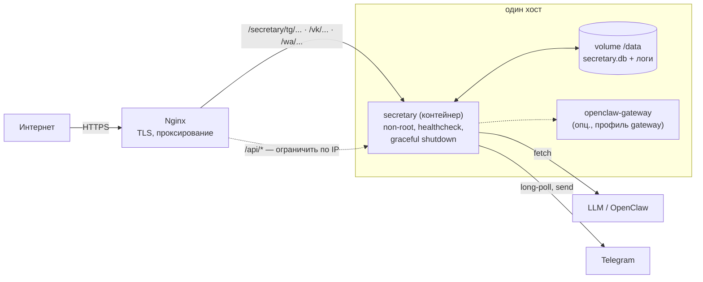

# Отчёт готовности к продакшну

> Дата: 2026-06-14. Версия: ветка `claude/stoic-gauss-txav4q` (этапы 0–4 + надёжность).
> Метод: автоматический аудит кода по 14 критериям + ручные правки + живые проверки.

## Вердикт

**Готов к боевому запуску для одного владельца (personal / small business).**
Это и есть целевой сценарий шаблона: один человек, один экземпляр, один workspace памяти.

❌ **Не готов к** мульти-тенант / высокой доступности (несколько реплик) — и не
проектировался для этого (см. «Ограничения по дизайну»).



## Scorecard (после правок этой итерации)

| # | Критерий | Было | Стало | Где |
|---|---|---|---|---|
| 1 | Graceful shutdown (SIGTERM/SIGINT) | ❌ | ✅ закрывает HTTP, control-loop, БД; hard-exit 10с | `server.js` |
| 2 | Лимит тела запроса | ✅ | ✅ `256kb`, `BODY_LIMIT` | `app.js` |
| 3 | Глобальный error-handler | ❌ | ✅ 400 на битый JSON, 413, 500 без стектрейса | `app.js` |
| 4 | uncaughtException / unhandledRejection | ❌ | ✅ логирование + корректное тушение | `server.js` |
| 5 | Timing-safe сравнение секретов | ⚠️ только WA | ✅ API_KEY, Telegram, VK, WA | `core/format.js` |
| 6 | HTTP rate-limit на webhook | ⚠️ | ⚠️ дедупликация есть; флуд-защита — на Nginx | `nginx/` |
| 7 | SQLite надёжность | ⚠️ только WAL | ✅ WAL + `busy_timeout=5s` + `synchronous=NORMAL` | `core/db.js` |
| 8 | Ротация логов | ✅ | ✅ `LOG_TTL_DAYS=30` | `state.js` |
| 9 | Секреты только из env | ✅ | ✅ в репо только плейсхолдеры | — |
| 10 | Таймаут LLM / Telegram | ⚠️ только LLM | ✅ LLM 45с, Telegram 15с (`TG_TIMEOUT_MS`) | `forward.js` |
| 11 | Health проверяет зависимости | ⚠️ | ✅ `SELECT 1` к БД, 503 при сбое; не светит owner_id | `app.js` |
| 12 | Контейнер: non-root, healthcheck, volume | ✅ | ✅ + graceful stop без SIGKILL | `Dockerfile` |
| 13 | package-lock закоммичен | ✅ | ✅ | — |
| 14 | Бэкап описан | ⚠️ | ✅ `.backup` SQLite + tar | `deployment.md` |

## Что с контейнером

**Контейнер уже есть и теперь production-hardened** — отдельно готовить не нужно:

- `Dockerfile`: `node:22-alpine`, зависимости отдельным слоем, **non-root** (`USER node`),
  стейт в volume `/data`, встроенный `HEALTHCHECK` (`/health` каждые 30с)
- **Graceful shutdown**: `docker stop` теперь завершает процесс чисто за десятки мс
  (раньше был бы SIGKILL через 10с на каждом деплое)
- `docker-compose.yml`: `restart: unless-stopped`, named volume, опциональный
  профиль `gateway` для OpenClaw рядом
- Проверено вживую: образ собирается, контейнер `healthy`, webhook создаёт pending,
  SIGTERM → exit 0

Запуск:
```bash
cp .env.example .env   # заполнить, chmod 600
docker compose up -d
```

## Ограничения по дизайну (осознанные, не баги)

- **Один экземпляр.** Дедупликация, rate-limit, ожидание ввода владельца и
  Telegram long-polling живут в памяти процесса; две реплики одного бота
  конфликтуют по `getUpdates`. Масштабирование — вертикальное. Для целевого
  сценария (один владелец) этого достаточно с запасом.
- **Отправка наружу без ретраев.** При сбое Telegram/VK/WA ответ не уходит,
  владелец видит «⚠️ ОТПРАВКА НЕ УДАЛАСЬ» в копии. LLM при сбое даёт fallback
  из персоны. Осознанный выбор: лучше промолчать, чем дублировать.
- **Логи содержат тексты переписок** (для отладки), с TTL-ротацией. Если это
  неприемлемо по приватности — `LOG_TTL_DAYS` короче или сборка логов наружу.
- **WhatsApp — платные диалоги** (тариф Meta); следить за объёмом.

## Чеклист перед запуском

**Безопасность**
- [ ] `API_KEY` и `WEBHOOK_SECRET` заданы (случайные строки)
- [ ] `/api/*` закрыт на Nginx по IP (раскомментировать в `nginx/secretary-webhook.conf`)
- [ ] `.env` с `chmod 600`, не в git
- [ ] HTTPS-домен с валидным сертификатом (Telegram требует HTTPS для webhook)
- [ ] Для каждой платформы — её секрет: `VK_SECRET`, `WA_APP_SECRET`

**Развёртывание**
- [ ] `docker compose up -d`, `/health` отдаёт `{"status":"ok","db":true}`
- [ ] Webhook зарегистрирован, `getWebhookInfo` без ошибок
- [ ] Business-подключение активно (Settings → Business → Chatbots)

**Эксплуатация**
- [ ] Бэкап `secretary.db` по расписанию (cron + `.backup`)
- [ ] Мониторинг `/health` (увидит 503 при сбое БД)
- [ ] Алерт на рестарты контейнера / `[uncaughtException]` в логах
- [ ] Прогон в `DRY_RUN=true` перед боем; первые дни — режим `/draft`

## Необязательное усиление (по желанию)

- Pin базового образа по digest (`node:22-alpine@sha256:...`) для воспроизводимости
- ESLint в CI (сейчас — `node --check` + 80 тестов)
- Структурированное логирование с уровнями вместо `console.*`
- Метрики (Prometheus `/metrics`): время ответа, доля fallback, длина очереди

## Итог

Ядро надёжно: 80 тестов, CI с Docker-smoke, graceful shutdown, проверка зависимостей,
timing-safe секреты, корректная обработка ошибок и таймауты. Для личного/SMB-сценария —
можно запускать. Оставшиеся пункты — либо осознанные рамки дизайна, либо необязательная
полировка, не блокирующая launch.
