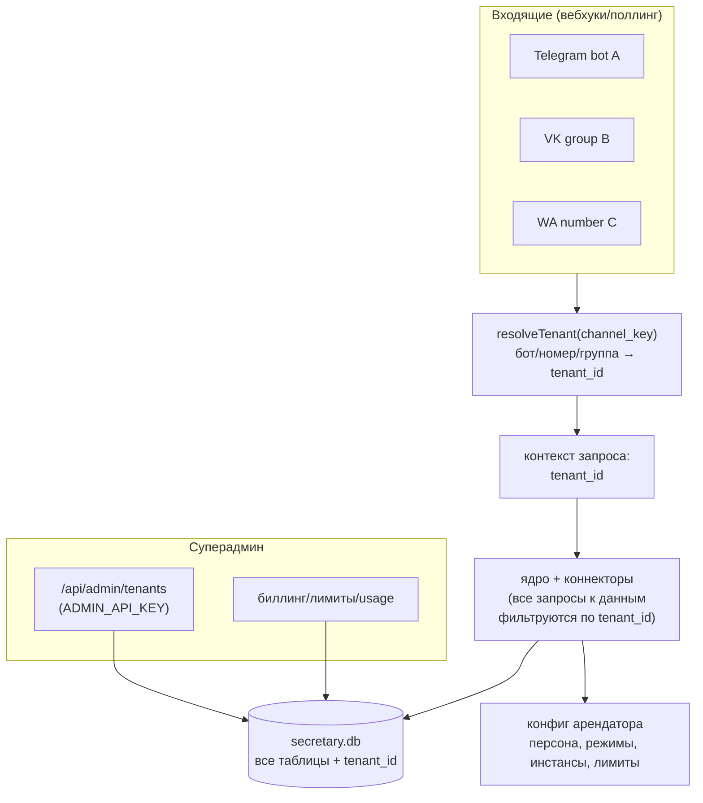
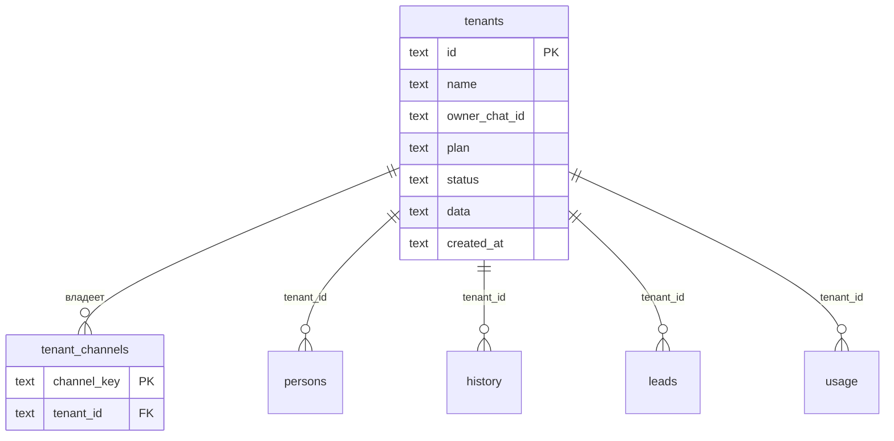

# SaaS-архитектура: мультиарендность

> Дизайн-документ (ADR + план). Описывает превращение single-owner шаблона в
> мультиарендный сервис (как у grandhub.ru). Реализуется поэтапно и **без поломки**
> текущего одно-владельческого режима — он становится арендатором `default`.

## Контекст и цель

Сейчас проект — single-tenant: один `OWNER_CHAT_ID`, один `secretary.db`, один
long-poll бота уведомлений, конфиги в env/файлах. Чтобы продавать как сервис, нужно:
несколько владельцев в одном инстансе, изоляция их данных, биллинг и лимиты,
самостоятельный онбординг.

## Ключевое решение: row-level мультиарендность (`tenant_id`)

Рассмотрены два варианта изоляции:

| Вариант | Плюсы | Минусы |
|---|---|---|
| **Row-level (`tenant_id` в одной БД)** ✅ | Один файл БД — простые бэкап/ops; сквозные admin/billing-запросы; масштаб на тысячи мелких арендаторов | Нужно протащить `tenant_id` через все запросы; риск утечки при ошибке фильтра |
| База на арендатора (`secretary-<id>.db`) | Жёсткая изоляция «по файлу» | Тысячи файлов; нет сводных запросов для биллинга; де-синглтон `getDb()` на каждый запрос |

**Выбор — row-level.** Биллинг и админка требуют сводных запросов по арендаторам;
один файл БД проще в эксплуатации. Изоляция обеспечивается обязательным
`tenant_id`-фильтром в слое данных (а не вызывающим кодом) + тестами на изоляцию.

## Целевая архитектура

### Резолв арендатора

Каждый арендатор регистрирует свои каналы. Входящее событие несёт идентификатор
канала, по нему находим арендатора:

| Платформа | `channel_key` | Откуда |
|---|---|---|
| Telegram Business | `tg:<bot_id>` | id Business-бота арендатора |
| ВКонтакте | `vk:<group_id>` | `event.group_id` |
| WhatsApp | `wa:<phone_number_id>` | `WA_PHONE_NUMBER_ID` арендатора |

Не нашли — событие отклоняется (неизвестный канал). Текущий одно-владельческий
деплой = арендатор `default`, его канал регистрируется из env при старте.

### Конфиг на арендатора

Сейчас глобальны: `OWNER_CHAT_ID`, persona (`persona/`), режимы (`mode.json`),
инстансы (`instances.json`), facts. В SaaS они **per-tenant**:

- `OWNER_CHAT_ID` → `tenants.owner_chat_id`
- persona / facts → строки в БД (или `tenants/<id>/persona/…`)
- режимы / черновики / контент-план → уже в БД, добавляется `tenant_id`
- инстансы (мозги) → per-tenant (свой LLM-ключ или общий пул с лимитами)

### Биллинг и лимиты

- **Метрика usage** на базе уже существующего `core/stats.js` + новой таблицы
  `usage` (сообщения, токены, платные WA-диалоги) с `tenant_id` и периодом.
- **Тарифы** (`plan`): Free (Telegram, лимит N сообщений/мес) → Pro (все платформы) →
  Enterprise (приоритет, белый лейбл).
- **Лимиты**: при превышении — мягкая деградация (только уведомления, без автоответа)
  и алерт арендатору; жёсткие — `suspended`.

### Онбординг (самообслуживание)

Цель — подключение без разработчика:
1. Арендатор регистрируется, получает `tenant_id` и админ-ссылку.
2. Подключает Business-бота → мастер автоматически регистрирует webhook (`setWebhook`).
3. Заполняет персону через форму (а не правкой файлов).
4. Тест в DRY_RUN → включение.

## Модель данных (целевая)

`tenant_id` добавляется ко всем таблицам данных (`persons`, `person_identities`,
`history`, `conversations`, `contacts`, `connections`, `pending`, `feedback`,
`leads`, `drafts`-в-БД) со значением по умолчанию `default` — миграция не теряет
данные существующего деплоя.

## Реализация контекста (S2)

Контекст арендатора — `core/context.js` на `AsyncLocalStorage`. Коннектор на входе
вызывает `runWithTenant(tenantId, fn)`; слой данных внутри читает `currentTenantId()`
и подставляет `WHERE tenant_id = ?`. Так изоляцию обеспечивает слой данных, а не
вызывающий код (нельзя «забыть» передать tenant). Без контекста — `default`,
поэтому одно-владельческий режим не меняется. Резолв: TG → `default` (один бот на
деплой), VK → `vk:<group_id>`, WA → `wa:<phone_number_id>`; не найден → `default`.
Scheduler хранит `tenantId` в задаче и исполняет ответ в `runWithTenant`.

## Реализация конфига per-tenant (S3)

Новые таблицы: `tenant_settings` (режимы `{mode,draft}` по арендатору) и
`tenant_persona` (`persona_json` + `base_md`/`dm_md`/`public_md`/`facts_md`).

- **Персона**: `loadPersona()` кэширует по арендатору. Источник: запись в
  `tenant_persona` → арендатор `default` без записи → файлы `persona/` (обратная
  совместимость) → прочие без записи → нейтральная generic (без имён). Admin задаёт
  персону: `POST /api/admin/tenants/:id/persona`.
- **Режимы** (`core/modes.js`): из `tenant_settings` по арендатору; старый `mode.json`
  мигрируется в `default`. Admin: `POST /api/admin/tenants/:id/settings`.
- **Уведомления владельцу**: `notifyOwnerText`/`editOwnerMessage` шлют на
  `tenants.owner_chat_id` текущего арендатора (fallback — env `OWNER_CHAT_ID`).

Осознанно отложено (общий ресурс для MVP достаточен): per-tenant инстансы мозга
(BYO-LLM — для Enterprise в S4), per-tenant контент-план и черновики, control-plane
от нескольких владельцев (привязано к онбордингу S5).

## Реализация биллинга (S4)

`core/billing.js` + таблица `usage` (tenant_id, period=YYYY-MM, metric, count).

- **Метрики**: `replies` (сгенерированные ответы) и `tokens` (если endpoint вернул usage) —
  пишутся в `core/brain.js` при успешной генерации. Входящие/диалоги берутся из `stats`.
- **Тарифы** (`PLANS` в коде): `free` (Telegram, 100 ответов/мес), `pro` (все платформы,
  5000), `enterprise` (все, безлимит). Арендатор `default` сидится как enterprise —
  single-owner не лимитируется. Арендатор без записи в реестре (тесты) — не лимитируется.
- **Гейт квоты**: `checkQuota(platform)` вызывается в `brain.respond` ДО генерации
  (экономит LLM). Отказ → `{ ok:false, limited:true, reason }`; коннекторы не отправляют
  ответ. Причины: `suspended`, `platform_not_in_plan`, `quota_exceeded`.
- **Деградация**: в личке владельцу шлётся алерт (троттлинг раз в час), на публичных
  поверхностях ответ просто пропускается. Жёсткий стоп — `status: suspended`.
- **Видимость**: `GET /api/admin/tenants/:id/usage`; строка расхода в дайджесте владельцу.

## Реализация онбординга (S5)

`core/onboarding.js` + `connectors/telegram/setup.js` + таблица `tenant_secrets`.

- **Сквозной онбординг** `onboard({id, name, owner_chat_id, plan, persona, bot_token})`:
  создаёт арендатора (если нет) → задаёт персону (`setTenantPersona`) → подключает бота →
  возвращает мастер готовности. Идемпотентно по `id`. Endpoint `POST /api/admin/onboard`.
- **Подключение бота** `connectTelegram(tenantId, {botToken})`: `getMe` (валидация токена,
  получение `@username`/`id`) → привязка канала `tg:<bot_id>` → генерация per-tenant секрета
  вебхука → `setWebhook(url, secret)`. URL берётся из `PUBLIC_BASE_URL`; без него вебхук
  не ставится (`webhook_skipped`), канал и секрет всё равно сохранены. Чужой бот (канал занят
  другим арендатором) — отказ. Endpoint `POST /api/admin/tenants/:id/connect/telegram`.
- **Секреты** в таблице `tenant_secrets (tenant_id, key, value, lookup)`: `tg_bot_token`,
  `tg_webhook_secret`. В мультиарендном режиме их нельзя держать в env (у каждого свои).
  Наружу через API **не отдаются** (только имена ключей).
- **Шифрование at-rest** (`core/secrets-crypto.js`): значения шифруются AES-256-GCM
  ключом из env `SECRETS_KEY` (sha256 → 32 байта; формат `v1.<iv>.<tag>.<ct>`). Ключ не
  задан → плейн (single-owner/отладка). Поисковые секреты (`tg_webhook_secret`) дополнительно
  индексируются «слепым индексом» HMAC-SHA256 в колонке `lookup` — резолв арендатора по
  секрету без хранения открытого значения и без полного перебора. Легаси-плейн читается как
  есть и перешифровывается при следующей записи (ленивая миграция). Смена `SECRETS_KEY`
  делает старые шифртексты нечитаемыми — поэтому смена ключа делается через ротацию (ниже).

### Ротация ключа шифрования (без простоя)

Версионирование ключей: `SECRETS_KEY` (основной) + `SECRETS_KEYS_OLD` (старые, через
запятую). Дешифровка пробует все ключи — нужный определяется по auth-тегу GCM.

1. Новый ключ → `SECRETS_KEY`, прежний → `SECRETS_KEYS_OLD`; рестарт. Всё читается
   (старые секреты — старым ключом), резолв вебхука/кабинета работает по индексам всех
   ключей (`blindIndexCandidates`).
2. `POST /api/admin/secrets/rotate` (`reencryptSecrets`): перешифровать все секреты
   основным ключом и пересчитать слепые индексы. Идемпотентно.
3. Убрать `SECRETS_KEYS_OLD`; рестарт. Старый ключ больше не нужен.

Интеграция с внешним KMS (Vault/Yandex/AWS) сводится к подстановке ключей в эти env.
- **Маршрутизация входящего**: апдейт несёт `X-Telegram-Bot-Api-Secret-Token`;
  `resolveTenantByWebhookSecret(secret)` определяет арендатора (секрет уникален → сам по себе
  авторизация). Нет совпадения → одно-владельческий путь: глобальный `WEBHOOK_SECRET` и
  арендатор `default` (поведение single-owner не меняется). Владелец business-сообщения
  сверяется с `owner_chat_id` текущего арендатора (fallback — env `OWNER_CHAT_ID`).
- **Мастер готовности** `checkReadiness(tenantId)` → `GET /api/admin/tenants/:id/readiness`:
  чеклист (статус активен, владелец задан, есть канал, подключён бот, персона, режим, квота).
  `ready=true`, если нет ни одного `fail`; `warn` — мягкое предупреждение.

## Свой LLM арендатора (BYO-LLM, Enterprise)

`core/tenant-llm.js` — арендатор подключает собственный OpenAI-совместимый endpoint
(или OpenClaw) вместо общего пула моделей сервиса.

- **Хранение**: несекретная часть (`driver`/`base_url`/`model`/`stateful`) — в
  `tenant_settings.data.llm`; `api_key` — в `tenant_secrets` (шифруется at-rest,
  наружу не отдаётся — только флаг `api_key_set`).
- **Гейт тарифа**: подключение разрешено планам с capability `byo_llm` (`PLANS` в
  `billing.js`; по умолчанию только `enterprise`).
- **Резолв**: в `core/brain.js` `getTenantInstance()` (по текущему арендатору) бьёт
  раньше глобального `getInstanceFor(routingKey)`. Не настроен → прежнее поведение
  (`instances.json`/env). Переопределяет routing для всех поверхностей арендатора.
- **Admin**: `GET/POST/DELETE /api/admin/tenants/:id/llm`.

## Приём оплаты (Robokassa)

`core/payments.js` (провайдеро-независимо) + `connectors/robokassa.js` (специфика провайдера).

- **Счёт** (`invoices`): `createInvoice(tenant, plan)` → `pending`. Сумма берётся из
  `PLAN_PRICES` (env `PRICE_PRO`/`PRICE_ENTERPRISE`) на сервере — клиенту не доверяем.
- **Ссылка оплаты**: `robokassa.buildPaymentUrl(invoice)` — подпись `md5(login:OutSum:InvId:Password1)`.
  Endpoint `POST /api/admin/tenants/:id/billing/checkout` отдаёт `payment_url`.
- **Подтверждение**: Robokassa дёргает Result URL `GET|POST /robokassa/result`
  (server-to-server). Авторизация — подписью `md5(OutSum:InvId:Password2)` (timing-safe),
  не API-ключом. Валидно → `markInvoicePaid` (применяет тариф + `active`, идемпотентно) →
  ответ `OK<InvId>` (иначе Robokassa повторяет вызов).
- **Лендинги**: `/robokassa/success`, `/robokassa/fail` (редирект браузера).
- Креды — в env (единый аккаунт Robokassa на сервис, не per-tenant).

## Личный кабинет арендатора (self-serve)

Статика `public/cabinet.html` (`/cabinet`, без фреймворка) + tenant-scoped API `/api/cabinet/*`.

- **Авторизация**: токен кабинета `cabinet_token` per-tenant (шифруется at-rest, поиск
  по слепому индексу). Middleware резолвит арендатора по `Authorization: Bearer`/
  `X-Cabinet-Token` → `req.cabinetTenant`. Нет токена → 401. Выдаёт оператор:
  `POST /api/admin/tenants/:id/cabinet-token` (показывается один раз).
- **Изоляция**: все операции — над `req.cabinetTenant.id` (из токена, не из URL),
  поэтому арендатор физически не может обратиться к чужим данным.
- **Эндпоинты**: `GET /api/cabinet` (обзор: тариф/usage/готовность/персона/каналы/счета),
  `POST /api/cabinet/persona`, `POST /api/cabinet/billing/checkout` (ссылка Robokassa),
  `POST /api/cabinet/connect/telegram`.
- Кабинет переиспользует онбординг (S5), персону (S3), биллинг и приём оплаты —
  это их self-serve витрина.

## Инварианты изоляции (безопасность)

- Слой данных **обязан** фильтровать по `tenant_id` — нельзя полагаться на вызывающий код.
- Резолв арендатора — единственная точка доверия; неизвестный канал отклоняется.
- Тесты на изоляцию: арендатор A не видит персон/историю/лиды арендатора B.
- Админ-API под отдельным `ADMIN_API_KEY` (не равен пользовательскому `API_KEY`).

## Поэтапный план (не ломая single-tenant)

| Фаза | Что | Риск | Статус |
|---|---|---|---|
| **S1. Реестр арендаторов** ✅ | `tenants` + `tenant_channels`, `core/tenant.js`, admin-API, seed `default` из env | низкий (аддитивно) | готово |
| **S2. Изоляция данных** ✅ | `tenant_id` во все таблицы + слой данных (AsyncLocalStorage-контекст); тесты изоляции и миграции | высокий | готово |
| **S3. Конфиг per-tenant** ✅ | персона/facts и режимы по арендатору (БД), уведомления на owner арендатора, admin-API | средний | готово (инстансы/контент-план — позже) |
| **S4. Биллинг/лимиты** ✅ | таблица `usage`, тарифы Free/Pro/Enterprise, гейт квоты в Brain, алерты, admin-usage | средний | готово |
| **S5. Онбординг** ✅ | self-serve (`onboard`), авто-`setWebhook` по секрету, форма персоны, мастер готовности, `tenant_secrets` | средний | готово |

Single-tenant остаётся рабочим режимом на каждом шаге: один арендатор `default`.

## Открытые вопросы

- Один общий бот уведомлений на всех арендаторов или по боту на арендатора?
  (влияет на резолв control-plane). Рекомендация: по боту на арендатора —
  чистый резолв и брендинг; общий — дешевле, но требует различать арендатора по owner-chat.
- Общий пул LLM-ключей с лимитами vs ключ арендатора (BYO-key для Enterprise).
- Хостинг: один инстанс на всех (этот дизайн) vs контейнер на арендатора
  (проще изоляция, дороже эксплуатация) — для старта один инстанс.
